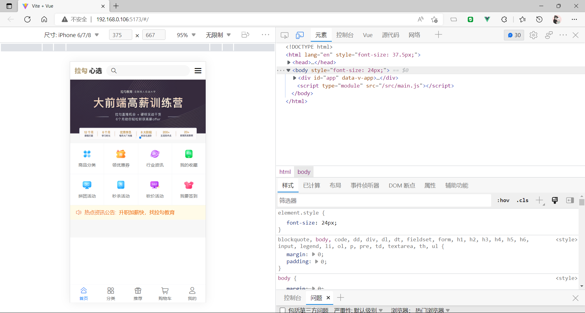

# 实战商城项目 ( 手机端 )

---

## 1. 创建项目

- 使用命令创建一个新的 Vue 3.x +  Vite 项目

```node
npm init vite@latest
yarn create vite
pnpm create vite
```

- 下载所需的软件包

  - 可以使用 cd FileName 进入文件 ( FileName 指的是当前文件的名称 )

    再使用包管理工具进行下载 ( 请参考下方包下载的示例 )

  - 将创建的文件夹直接拖拽到 VSCode 中, 再使用包管理工具下载 package.json 中的软件包

```node
npm install
npm i
yarn
pnpm insatll
pnpm i
```

---

## 2. Git 备份

- 在 GitHub 官网创建一个代码库


- 创建成功后可以按照页面提示, 首次提交代码块


```init
// todo: 初始化项目
// * 初始化 Git
git init
// * 创建初始化文件
git add README.md
// 提交代码到本地
git commit -m "first commit"
// 2
git branch -M main
// 配置远程仓库入口
git remote add origin https://github.com/userName/codeBase.git
// 发送代码块至仓库
git push -u origin main

```

---

## 3. 下载插件

- 下载 vant@next, 使用命令:

```node
npm install vant@next
npm i vant@next
yarn add vant@next
```

- 下载路由插件 vue-router

```node
npm install vue-router@4
npm i vue-router@4
yarn add vue-router@4
```

- 下载 Vuex 插件

``` node
npm install vuex@next -S
npm i  vuex@next -S
yarn add vuex@next -S
```

- 下载 sass 样式预编译脚本

``` node
npm install -D sass
npm i -D sass
yarn add -D sass
```

---

## 4. 校验代码

- 下载 ESLint 代码校验工具

```node
npm install eslint eslint-cli -D
npm i eslint eslint-cli -D
yarn add eslint eslint-cli -D
```

- 初始化文件

```node
npx eslint --init

1.To check syntax, find problems, and enforce 
code style
2.JavaScript modules (import/export)
3.Vue.js
4.No
5.Browser && Node ( 上下选择; 空格选中 )
6.Use a popular style guide
7. Standard: https://github.com/standard/standard
8.JavaScript
9.Yes
```

- 配置文件

```.eslintrc.cjs
module.exports = {
  env: {
    browser: true,
    es2021: true,
    node: true
  },
  extends: [
    // 'plugin:vue/vue3-essential',
    'plugin:vue/vue3-strongly-recommended',
    'standard'
  ],
  overrides: [
  ],
  parserOptions: {
    ecmaVersion: 'latest',
    sourceType: 'module'
  },
  plugins: [
    'vue'
  ],
  rules: {
  }
}
```

### 友情连接

```href
https://eslint.vuejs.org/
```

---

## 5. 配置文件

1. 删除 ./src/components/HelloWorld.vue 文件
2. 删除 ./src/App.vue 文件内容

``` vue
<script setup>
{{--[remove Script]
// This starter template is using Vue 3 <script setup> SFCs
// Check out https://vuejs.org/api/sfc-script-setup.html#script-setup
import HelloWorld from './components/HelloWorld.vue'}}
</script>

<template>
{{--[remove Elements]
  <div>
    <a
      href="https://vitejs.dev"
      target="_blank"
    >
      
    </a>
    <a
      href="https://vuejs.org/"
      target="_blank"
    >
      
    </a>
  </div>
  <HelloWorld msg="Vite + Vue" />
}}
{{--[create Elements]
  <div>Loading...</div>
}}
</template>

<style scoped>
{{--[remove Styles]
.logo {
  height: 6em;
  padding: 1.5em;
  will-change: filter;
}
.logo:hover {
  filter: drop-shadow(0 0 2em #646cffaa);
}
.logo.vue:hover {
  filter: drop-shadow(0 0 2em #42b883aa);
}
}}
</style>

```

3. 删除 ./src/assets/logo.png || ./src/assets/vue.svg 文件
4. 删除 ./src/style.css 文件 && ./src/main.js 引入项

```main.js
import { createApp } from 'vue'
{{--[remove Scripts]
import './style.css'
}}
import App from './App.vue'

createApp(App).mount('#app')

```

- 配置文件

``` file
- .vscode [ VSCode 配置文件 ]
- node_modules [ 下载的插件包 ]
- public [ 公共组件 ]
- src [ 开发文件 ]
  - api [ 接口的相关模块 ]
  - assets [ 静态资源文件 ]
  - components [ 公共组件 ]
  - composables [ 公共函数 || 组合式 API ]
  - router [  ]
  - store [  ]
  - styles [ 公共样式文件 ]
  - utils [ 工具模块 ]
  - views [ Vue 单文件 ]
  - APP.vue
  - main.js
- .eslintrc.cjs
- .gitignore
- index.html
- package.json
- README.md
- vite.config.js
- yarn.lock
```

---

## 6. 安装 axios

- 这里使用:

``` node
npm install axios
npm i axios
yarn add axios
```

- 统一配置: ./src/utils/request.js [ create ]

```
// axios
import axios from 'axios'

const request = axios.create({
  baseURL: 'https://shop.fed.lagounews.com/api'
})

export default request

```

---

## 7. 配置 Router

- 创建文件

``` file
./src/views

- Home [ 主页 ]
    - index.vue
- Category [ 分类 ]
    - index.vue
- CategoryDetail [ 指定分类 ]
    - index.vue
- Recommend [ 推荐页 ]
    - index.vue
- Login [ 登录页 ]
    - index.vue
- Cart [ 购物车 ]
    - index.vue
- User [ 用户页 ]
    - index.vue
- Order [ 订单页 ]
    - index.vue
- OrderConfirm [ 订单确认页 ]
    - index.vue
- OrderDetail [ 订单详情页 ]
    - index.vue
- Pay [ 支付页 ]
    - index.vue
- Product [ 商品页 ]
    - index.vue
- Search [ 搜索页 ]
    - index.vue
- NotFound [ 404 ]
```

- 创建 Vue-router 基础配置

```js
// Url: [ ./src/router/index.js ]

import { createRouter, createWebHashHistory } from 'vue-router'

// 配置路由规则
const routes = [
    {
        path: '/Login',
        name: 'Login',
        component: () => import('@/views/Login.vue')
    },
    {
        path: '/',
        name: 'Home',
        component: () => import('@/views/Home/index.vue')
    },
    {
        path: '/category',
        name: 'Category',
        component: () => import('@/views/Category/index.vue')
    },
    {
        path: '/category-detaill/:categoryId',
        name: 'CategoryDetaill',
        component: () => import('@/views/CategoryDetaill/index.vue'),
        props: true
    },
    {
        path: '/order-confirm',
        name: 'OrderConfirm',
        component: () => import('@/views/OrderConfirm/index.vue'),
        props: true
    },
    {
        path: '/order',
        name: 'Order',
        component: () => import('@/views/Order/index.vue')
    },
    {
        path: '/order-detail/:orderId',
        name: 'OrderDetail',
        component: () => import('@/views/OrderDetail/index.vue')
    },
    {
        path: '/pay',
        name: 'Pay',
        component: () => import('@/views/Pay/index.vue')
    },
    {
        path: '/product/:productId',
        name: 'Product',
        component: () => import('@/views/Product/index.vue')
    },
    {
        path: '/recommend',
        name: 'Recommend',
        component: () => import('@/views/Recommend/index.vue')
    },
    {
        path: '/cart',
        name: 'Cart',
        component: () => import('@/views/Cart/index.vue')
    },
    {
        path: '/search',
        name: 'Search',
        component: () => import('@/views/Search/index.vue')
    },
    {
        path: '/user',
        name: 'User',
        component: () => import('@/views/User/index.vue')
    },
    {
        path: '/:pathMatch(.*)*',
        name: 'NotFound',
        component: () => import('@/views/NotFound/index.vue')
    }
]

const router = createRouter({
    history: createWebHashHistory(),
    routes
})

export default router
```

- 为了让上方的 @ 起作用 ( 原本是 WebPack 中的一个替换功能, 将 @ 自动替换成 src 目录 ), 所以这里要将 Vite 的配置文件进行补充更改

``` js
// ./vite.config.js
import { defineConfig } from 'vite'
import vue from '@vitejs/plugin-vue'

// 调取 path 中的 resolve 方法, 用于拼接绝对路径
import { resolve } from 'path'

// https://vitejs.dev/config/
export default defineConfig({
  plugins: [vue()],
  // 这里添加规则
  resolve: {
      // 替换配置
    alias:[
      {
          // 这里给的是一个替换的字符串
        find: '@',
          // 这里为了查找更精确使用了 node 中的 path 组件中的 resolve 模块
        replacement: resolve(__dirname, 'src')
      }
    ]
  }
})

```

- 全部配置完成后记得在 App.vue 中输出 VueRouter 组件

``` vue
<script setup>

</script>

<template>
  <div>Loading...</div>
  <!-- 跟路由出口 -->
  <router-view></router-view>
</template>

<style scoped>
</style>

```

---

## 8. 移动端的适配

- 下载 amfe-flexible 插件

``` node
npm install amfe-flexible -s
npm i amfe-flexible -s
yarn add amfe-flexible -s
```

- 下载 postcss-pxtorem 插件

``` node
npm install postcss-pxtorem -d
npm i postcss-pxtorem -d
yarn add postcss-pxtorem -d
```

- 先引入 amfe-flexible 插件

```js
// src/main.js

import { createApp } from 'vue'
import App from './App.vue'
import router from './router'

==========
// 此处直接引入即可
import 'amfe-flexible'
==========
    
const app = createApp(App);
app.use(router);
app.mount('#app');

```

- 配置 postcss-pxtorem 插件

```cjs
// Create New File
// ./postcss.config.cjs

module.exports = {
    plugins: {
        'postcss-pxtorem': {
            rootValue: 37.5,
            propList: ['*'],
        }
    }
}
```

---

## 9. 公共样式模块

- 在 ./src/styles 目录下创建一个 base.css 文件

```scss
html {
    color: #000;
    background: #fff
}

blockquote,
body,
code,
dd,
div,
dl,
dt,
fieldset,
form,
h1,
h2,
h3,
h4,
h5,
h6,
input,
legend,
li,
ol,
p,
pre,
td,
textarea,
th,
ul {
    margin: 0;
    padding: 0
}

table {
    border-collapse: collapse;
    border-spacing: 0
}

fieldset,
img {
    border: 0
}

address,
caption,
cite,
code,
dfn,
em,
strong,
th,
var {
    font-style: normal;
    font-weight: 400
}

ol,
ul {
    list-style: none
}

caption,
th {
    text-align: left
}

h1,
h2,
h3,
h4,
h5,
h6 {
    font-size: 100%;
    font-weight: 400
}

em,
i {
    font-style: normal
}

q:after,
q:before {
    content: ''
}

abbr,
acronym {
    border: 0;
    font-variant: normal
}

sup {
    vertical-align: text-top
}

sub {
    vertical-align: text-bottom
}

input,
select,
textarea {
    font-family: inherit;
    font-size: inherit;
    font-weight: inherit;
    font-size: 100%;
    outline: 0;
    border: 0
}

legend {
    color: #000
}

// 温馨提示如果是 sass 则需要使用:
// 非安装: yarn add sass -g
// 安装后: sass ./src/sass/base.scss ./src/styles/base.css
```

---

## 10. 公共组件 ( 底部组件 )

- 在开始前需要先导入 Vant Vue 3.x 的组件库 [ <a href="http://vant-contrib.gitee.io/vant/#/zh-CN" style="text-decoration: none;">Vue3 的 Vant 组件库官网</a> ]

```text
// Vant 的组件库 ( Vue 3.x版本 )
// http://vant-contrib.gitee.io/vant/#/zh-CN
```

- 在 ./src/components 目录下创建 footer.vue 文件

```vue
<template>
	<!-- route:Boolean = 是否开启路由模式[ 默认 false ] -->
	<!-- 此处使用 route 进行路由自动加载; -->
    <van-tabbar route>
        <!-- icon: 图标 [ 具体请参考官网的 icon ]; -->
        <!-- to:String || Obj = 点击后跳转的目标路由对象，等同于 vue-router 的 to 属性 -->
        <van-tabbar-item icon="home-o" to="/">首页</van-tabbar-item>
        <van-tabbar-item icon="apps-o" to="/category">分类</van-tabbar-item>
        <van-tabbar-item icon="gift-o" to="/recommend">推荐</van-tabbar-item>
        <van-tabbar-item icon="shopping-cart-o" to="/cart">购物车</van-tabbar-item>
        <van-tabbar-item icon="contact" to="user">我的</van-tabbar-item>
    </van-tabbar>
</template>

<script setup>

</script>

<style lang="scss" scoped>
    // 增加 fixed 权重
    .van-tabbar {
        position: fixed !important;
    }
</style>
```

- 将组建引入至 Home [ 首页 ], Category [ 分类页 ], Recommend [ 推荐页 ], Cart [ 购物车 ], User [ 用户页 ] 页面中

``` vue
<template>
	<div>
		<p>English</p>
		<p>xx页面</p>
		<footerVue />
	</div>
</template>

<script setup>
	import footerVue from '@/components/footer.vue';
</script>

<style lang="scss" scoped>

</style>

```

---

## 11. 公共组件 ( 顶部组件 )

- 在 ./src/views/Home 创建 components 组件文件夹, 再在文件夹内部创建两个 Vue 文件, 分别是: Header.vue [ 头部文件 ]、Main.vue [  ]

```vue
// ./src/views/Home/components/Header.vue
<template>
    <div class="home-nav">
        <!-- Logo 区域 -->
        
        <!-- 搜索区域 -->
        <div class="home-search">
            <van-icon name="search" size="0.5rem" />
        </div>
        <!-- 分类跳转 -->
        <van-icon name="wap-nav" />
    </div>
</template>

<script setup>
    import Logo from '@/assets/logo.png';
</script>

<style lang="scss" scoped>
// 主体部分
.home-nav {
    position: fixed !important;
    top: 0;
    left: 0;
    display: flex;
    align-items: center;
    width: 100%;
    height: 50px;
    background-color: #fff;
    padding-right: 10px;
    box-sizing: border-box;
    z-index: 999;

    // Logo
    img {
        margin: 0 10px;
    }

    // 搜索区域
    .home-search{
        display: flex;
        align-items: center;
        width: 100%;
        height: 30px;
        background-color: #f7f7f7;
        border-radius: 25px;
        padding-left: 12px;
        margin-right: 10px;
    }
}
</style>

```

- 此处是 Main.vue 文件

``` vue
<template>
    <div class="main-vue">
        <!-- Vant 的 Swipe 组件 -->
        <van-swipe class="my-swipe" :autoplay="3000" indicator-color="sykblue">
            <van-swipe-item
                v-for="(item, index) in swipeData"
                :key="index">
                
            </van-swipe-item>
        </van-swipe>

        <!-- Vant 的 Grid 宫格 组件 -->
        <van-grid :column-num="4">
            <van-grid-item
                v-for="(item, index) in gridData"
                :key="index"
                :icon="item.img"
                :text="item.info[0].value" />
        </van-grid>

        <!-- Vant 的 NoticeBar 通知栏 组件 -->
        <van-notice-bar left-icon="volume-o" :scrollable="false">
            <span>热点资讯公告:&ensp;</span>
            <van-swipe
                vertical
                class="notice-swipe"
                :autoplay="3000"
                :touchable="false"
                :show-indicators="false"
            >
                <van-swipe-item
                    v-for="(item, index) in noticeData"
                    :key="index"
                    v-text = "item.chiild[0].val"
                />  
            </van-swipe>
        </van-notice-bar>
    </div>
</template>

<script setup>
// 引入并解构 ref, computed 组件
import { ref, computed } from 'vue'
// 引入 Home 的数据获取方法
import { getHomeData } from "@/api/index";

// 存储首页的所有数据 ( ref 响应式数据 )
const indexData = ref({})

// 封装首页的初始化数据方法
const initIndexData = async () => {
    // 解构 [ 数据中的 data ] 项
    const { data } = await getHomeData()

    // 判断是否获取到数据
    if(data.status !== 200) {
        // 未获取到数据则直接返回
        return;
    }

    // 将获取到的数据赋值给 indexData
    indexData.value = data.data
}

// 调用首页的初始化数据方法
initIndexData()


// 通过 computed 计算属性，将 indexData 中的数据，转换成组件需要的数据
// * A: 轮播图数据
// ! 此处使用 ? 可选链，防止数据为空时，程序报错
const swipeData = computed(() => indexData.value.swiperBg?.default.imgList.list)

// * B: 宫格数据
const gridData = computed(() => indexData.value.menus?.default.imgList.list)

// * C: 通知栏数据
const noticeData = computed(() => indexData.value.news?.default.newList.list)

</script>

<style lang="scss" scoped>
// 设置主体
.main-vue{

    // 设置轮播图
    .my-swipe{
        
        // 设置轮播图的高度
        img{
            width: 100%;
            height: 170px;
        }
    }

    // 设置通知栏
    :deep(.van-notice-bar__content) {
        display: flex;
        align-items: center;
    }
  .notice-swipe {
        height: 40px;
        line-height: 40px;
    }
}
</style>
```

※ 注意: 做完以上内容别忘记在 .../Home/index.vue 中链入当前文件

```vue
<template>
		<!-- 公共顶部 -->
		<HeaderVue />

		<!-- 主体部分 -->
		<MainVue class="main-vue" />

		<!-- 公共底部 -->
		<FooterVue />
</template>

<script setup>
	// 引入固定头部
	import HeaderVue from './components/Header.vue';
	// 引入主体
	import MainVue from './components/Main.vue';
	// 引入固定底部
	import FooterVue from '@/components/Footer.vue';
</script>

<style lang="scss" scoped>
	.main-vue{
		background-color: #f7f7f7;
		padding: 50px 0;
	}
</style>

```

### 样图 - 01

- 完成以上部分后的例图为:



---

## 12. 公共组件 ( 主体宫格 )

- 在 ./src/components 文件夹下创建 ProductList.vue [ 商品列表 ]

``` vue
```

- 将 ProductList.vue 嵌套至 ./src/views/Home/components/Main.vue

```vue
<template>
    <div class="main-vue">
        <!-- Vant 的 Swipe 组件 -->
        <van-swipe class="my-swipe" :autoplay="3000" indicator-color="sykblue">
            <van-swipe-item
                v-for="(item, index) in swipeData"
                :key="index">
                
            </van-swipe-item>
        </van-swipe>

        <!-- Vant 的 Grid 宫格 组件 -->
        <van-grid :column-num="4">
            <van-grid-item
                v-for="(item, index) in gridData"
                :key="index"
                :icon="item.img"
                :text="item.info[0].value" />
        </van-grid>

        <!-- Vant 的 NoticeBar 通知栏 组件 -->
        <van-notice-bar left-icon="volume-o" :scrollable="false">
            <span>热点资讯公告:&ensp;</span>
            <van-swipe
                vertical
                class="notice-swipe"
                :autoplay="3000"
                :touchable="false"
                :show-indicators="false"
            >
                <van-swipe-item
                    v-for="(item, index) in noticeData"
                    :key="index"
                    v-text = "item.chiild[0].val"
                />  
            </van-swipe>
        </van-notice-bar>

        <!-- new: 以下是 Vant 的 Grid 宫格 组件 -->
        <ProductListVue />
    </div>
</template>

<script setup>
// 引入并解构 ref, computed 组件
import { ref, computed } from 'vue'

// 引入 Home 的数据获取方法
import { getHomeData } from "@/api/index";

// new: 引入 ProductList 组件
import ProductListVue from "@/components/ProductList.vue";

// 存储首页的所有数据 ( ref 响应式数据 )
const indexData = ref({})

// 封装首页的初始化数据方法
const initIndexData = async () => {
    // 解构 [ 数据中的 data ] 项
    const { data } = await getHomeData()

    // 判断是否获取到数据
    if(data.status !== 200) {
        // 未获取到数据则直接返回
        return;
    }

    // 将获取到的数据赋值给 indexData
    indexData.value = data.data
}

// 调用首页的初始化数据方法
initIndexData()


// 通过 computed 计算属性，将 indexData 中的数据，转换成组件需要的数据
// * A: 轮播图数据
// ! 此处使用 ? 可选链，防止数据为空时，程序报错
const swipeData = computed(() => indexData.value.swiperBg?.default.imgList.list)

// * B: 宫格数据
const gridData = computed(() => indexData.value.menus?.default.imgList.list)

// * C: 通知栏数据
const noticeData = computed(() => indexData.value.news?.default.newList.list)

</script>

<style lang="scss" scoped>
// 设置主体
.main-vue{

    // 设置轮播图
    .my-swipe{
        
        // 设置轮播图的高度
        img{
            width: 100%;
            height: 170px;
        }
    }

    // 设置通知栏
    :deep(.van-notice-bar__content) {
        display: flex;
        align-items: center;
    }
  .notice-swipe {
        height: 40px;
        line-height: 40px;
    }
}
</style>
```

